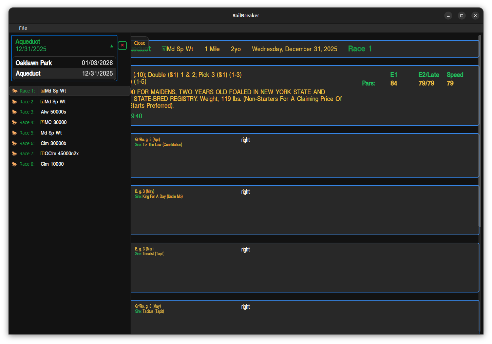

# RailBreaker

Is a Rust/Tauri app for handicapping horse races. It uses the single-file data files from Brisnet.

#### Railbreaker can do this at present:

- Unzip and load a racecard file.
- Load a previously unzipped racecard file.
- Load multiple racecards. (Racecard selection is changed in the sliding-left menu.)
- The basic racecard is complete. (I need to proofread it more against Brisnet PPs.)
- Added a tooltip to the comments. When clicking on a comment, you can see the extended comment if one is available. I'll be adding more helpful tooltips like this where I think they'd be useful.
- Printouts are working. It prints the whole card right now, but I plan to add a dialog box to allow the user to select either all races or select which ones to print.
- Added a Print Dialog box so that the user can select what races should be printed. See pic below.
- Switched to a Sqlite database instead of the .json files.
- Notes for each horse are working.

#### Things to do:

- Add more bells and whistles over time to the UI.
- Do analysis of the racecard data and see what's useful to know.

#### Racecard is Complete:

#### Sliding Menu

#### Sample Printout

#### Print Dialog Box

