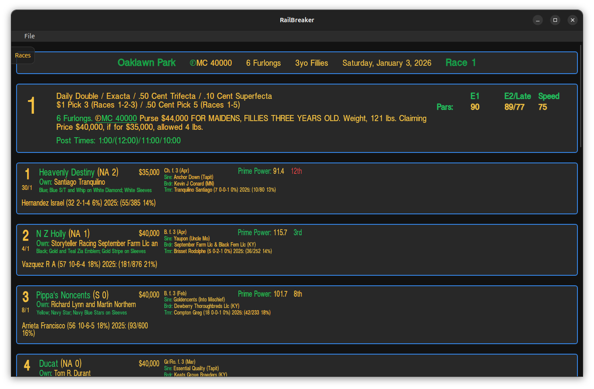
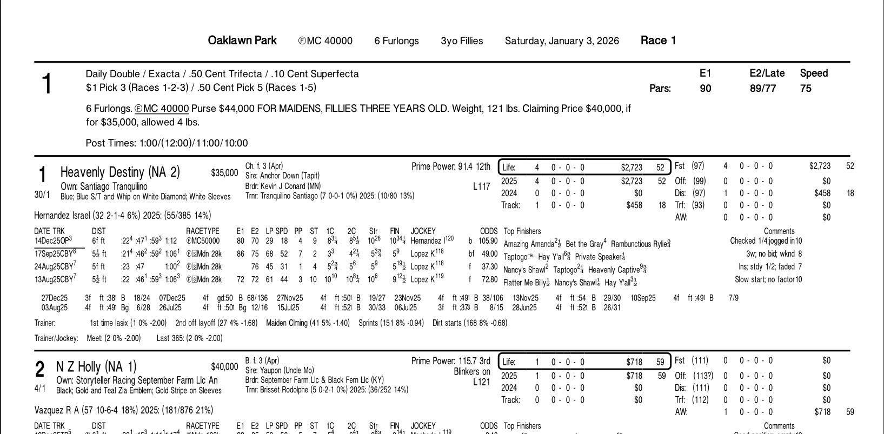
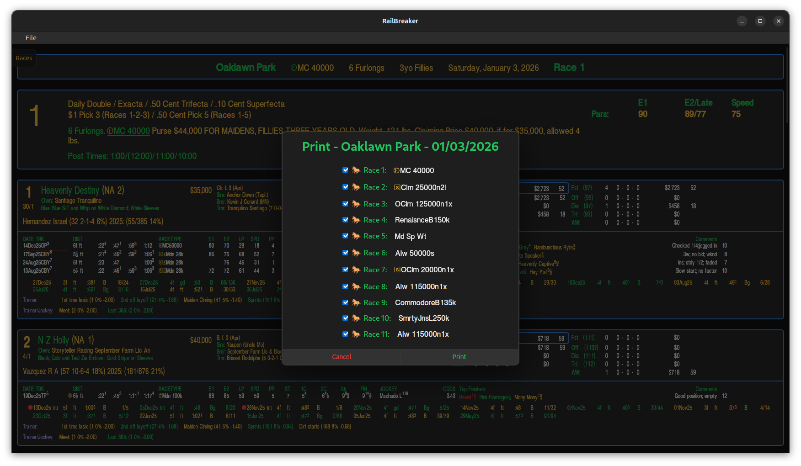
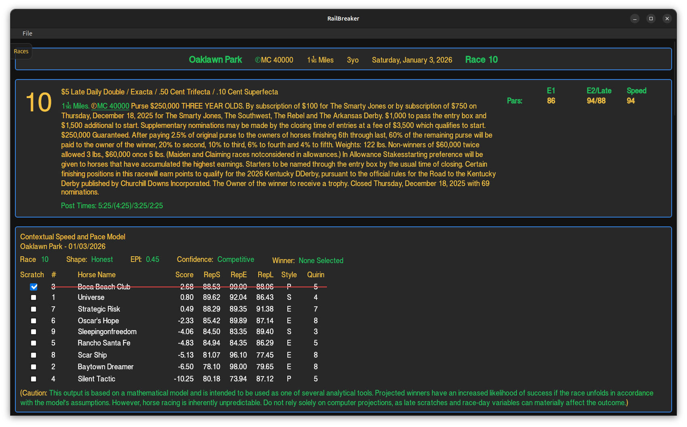

# RailBreaker

Is a Rust/Tauri app for handicapping horse races. It uses the single-file data files from Brisnet.

#### To compile RailBreaker:
You will need to use the [railbreaker-lib](https://github.com/mdg1019/railbreaker-lib) to compile RailBreaker. Directions for using the library are contained in the library's README. Easy to use!!!

#### Windows Users Installation:
I do not have a signing certificate. You will be asked about this during installation. Go ahead and install it. To run the app, you need to run it as an Administrator. Just right-click the app's icon and select ***Run as Administrator***.

#### Railbreaker can do this at present:

- Unzip and load a racecard file.
- Load a previously unzipped racecard file.
- Load multiple racecards.
- Printouts are working. A Print Dialog box is available to select all or individual races.
- SQLite database holds the racecard info.
- Notes for each horse is available.
- Contextual Speed and Pace Model attempts to determine the outcome of each race.
- Trip Handicapping Model helps you see significant trip comments.
- Sorting of the horses by varying means.

#### Racecard:

#### Sample Printout

#### Print Dialog Box

#### Contextual Speed and Pace Model
